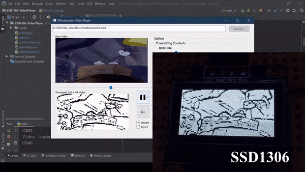

# Embedded Video Player for STM32

## About
This experimental video player that can open a video file via a GUI interface, preprocess it and stream it via USB VCP to a compatible microcontroller which then displays frames on a graphic LCD. In my implementation I have used an STM32 MCU with full-speed USB which receives each frame and sends it to a 128x64 I2C display (SSD1306).


## Prerequisites

- Ensure PyQt5 and pyserial packages are installed on your computer.
```
 pip install PyQt5 pyserial
 ```

## Usage

- Run the ```SKEmbedded Video Player.pyw```
file using Python.

```
pythonw SKEmbedded Video Player.pyw
```

 ## Demo 

 https://youtu.be/npBdJ8YWIas

